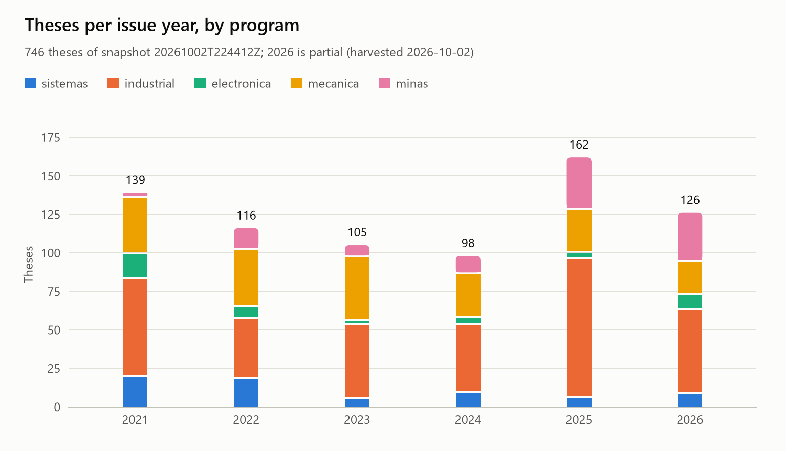
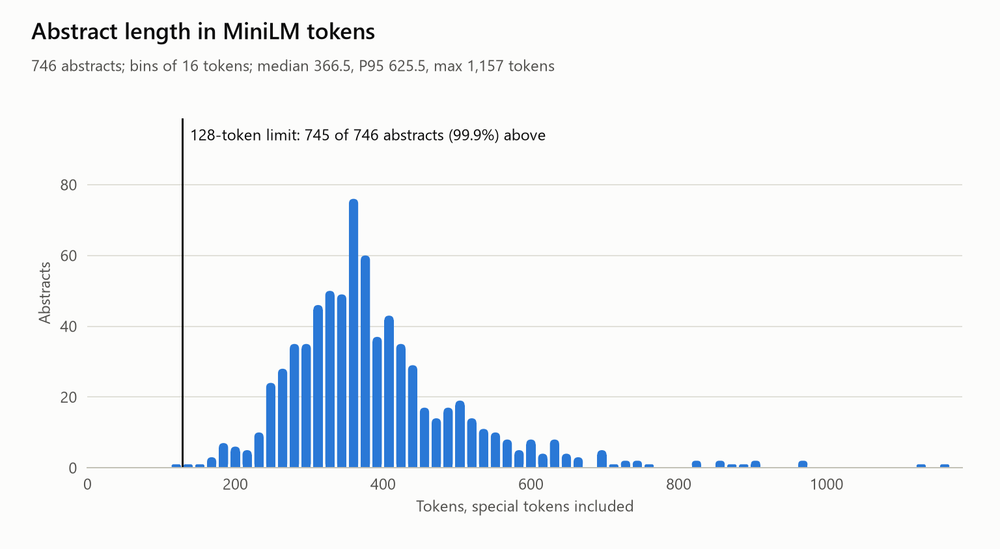
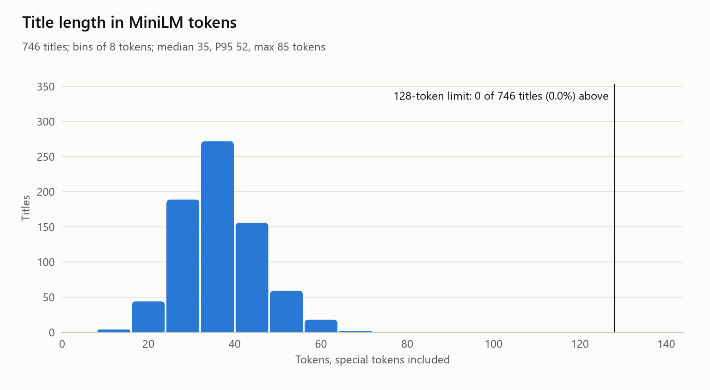
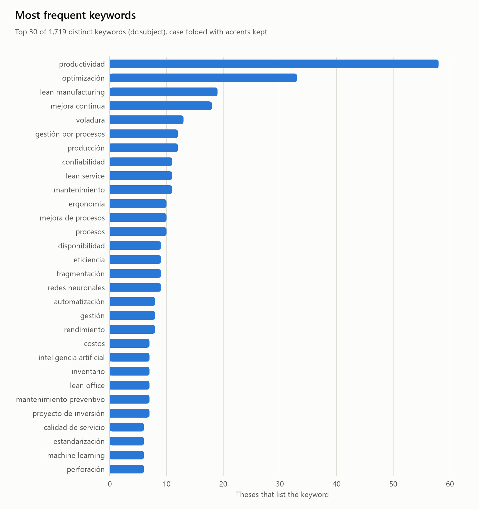

# Metadata profile of snapshot 20261002T224412Z

Aggregates only: no title, abstract, author, advisor or juror name appears in this report, in `metadata_profile.json`, or in the figures.

- **Source:** `data/raw/20261002T224412Z/metadata.jsonl`, harvested 2026-10-02T22:44:12Z (SHA-256 `d88839012df3…`).
- **Code:** `experiments/eda_metadata.py` at git `54173b8` with uncommitted changes; configuration SHA-256 `e6de0c5a5ab8…`.
- **Tokens:** the tokenizer of `sentence-transformers/paraphrase-multilingual-MiniLM-L12-v2`, special tokens included (2 per sequence); the model reads at most 128 tokens.

## Observations

- **Abstracts need chunking (D09); titles do not.** 745 of 746 abstracts (99.9%) exceed the 128-token window (median 366.5 tokens, P95 625.5). Sentence-aligned packing needs a median of 4 chunks per abstract, up to 13. The longest title has 85 tokens.
- **Both texts need cleaning before use.** 397 titles (53.2%) end with a place and/or year suffix (D10); 263 of them name Arequipa. 716 of 746 abstracts are hard-wrapped, and 85.7% of their 13,214 line breaks fall inside a sentence, so the light cleaner must join lines before sentences are split (T11, T13).
- **Keywords are sparse.** A thesis lists a median of 3 keywords; 1,719 distinct keywords remain after case folding, 84.0% of them used by one thesis only, and the most frequent one appears in 58 theses. They can label topics, but they are too sparse to define them.
- **The programs are unbalanced.** Ingeniería Industrial holds 45.6% of the theses and Ingeniería Electrónica 6.2%, so topic sizes and gap rules need per-program normalization (R5). The busiest year is 2025 (162 theses).
- **OCDE codes vary within some programs.** Within each program, its most frequent code covers 37.0% to 95.3% of its theses; 42 distinct codes occur in all.
- **Duplicates, dates and rights need care.** Groups of theses that share their title and abstract: 2, holding 4 records, so the census has 744 distinct theses and T12 must keep one record of each. Theses issued after the snapshot date (2026-10-02): 2; T06 and T27 must handle them. Embargoed theses: 8, of which 7 have an end date already passed; restricted theses: 6.

## Corpus

766 items: 746 theses (exact `renati.type` fragment `#tesis`), profiled below, and 20 other items, reported apart.

Groups of theses that repeat both the title and the abstract of another: 2, holding 4 records. Counted once each, the theses number 744. The profile below still counts every record.

| Other item type | Items |
|---|---:|
| trabajoDeSuficienciaProfesional | 15 |
| Trabajo de Suficiencia Profesional | 1 |
| TrabajodeSuficienciaProfesional | 1 |
| trabajo de suficiencia profesional | 1 |
| trabajoAcademico | 1 |
| trabajodesuficienciaprofesional | 1 |

Their programs: `sistemas` 2, `industrial` 9, `electronica` 9. Issued after the snapshot date: 0.

## Theses by program and issue year

| Program | 2021 | 2022 | 2023 | 2024 | 2025 | 2026 | Total |
|---|---:|---:|---:|---:|---:|---:|---:|
| Ingeniería de Sistemas (`sistemas`) | 19 | 18 | 5 | 9 | 6 | 8 | 65 |
| Ingeniería Industrial (`industrial`) | 64 | 39 | 48 | 44 | 90 | 55 | 340 |
| Ingeniería Electrónica (`electronica`) | 16 | 8 | 3 | 5 | 4 | 10 | 46 |
| Ingeniería Mecánica, Mecánica-Eléctrica y Mecatrónica (`mecanica`) | 37 | 37 | 41 | 28 | 28 | 21 | 192 |
| Ingeniería de Minas (`minas`) | 3 | 14 | 8 | 12 | 34 | 32 | 103 |
| **Total** | 139 | 116 | 105 | 98 | 162 | 126 | 746 |

- Issue dates run from 2021-01-06 to 2026-12-04. Theses without a readable `dc.date.issued`: 0.
- Theses issued after the snapshot date (2026-10-02): 2. The year 2026 is partial.

## Abstracts

Theses with an abstract: 746; without one: 0.

| Measure | Min | P25 | Median | P75 | P95 | Max |
|---|---:|---:|---:|---:|---:|---:|
| Characters | 661 | 1,483 | 1,718 | 1,993.2 | 2,884.8 | 5,429 |
| Words | 91 | 227.2 | 266 | 313 | 449.8 | 860 |
| MiniLM tokens | 126 | 313 | 366.5 | 436 | 625.5 | 1,157 |

Abstracts above 128 tokens: 745 (99.9%).

Chunks of 128 tokens that each abstract needs:

| Chunks | Abstracts, sentence-aligned | Abstracts, lower bound |
|---:|---:|---:|
| 1 | 1 | 1 |
| 2 | 28 | 53 |
| 3 | 204 | 371 |
| 4 | 293 | 218 |
| 5 | 130 | 68 |
| 6 | 57 | 22 |
| 7 | 12 | 6 |
| 8 | 10 | 5 |
| 9 | 3 | 1 |
| 10 | 4 | 1 |
| 11 | 3 | 0 |
| 13 | 1 | 0 |

Text defects that the cleaner must handle:

- Hard-wrapped abstracts: 716, with 13,214 line breaks in all: 11,327 inside a sentence and 14 right after a hyphen.
- Abstracts holding U+FFFD, a character lost to a wrong encoding: 1.
- Abstracts that embed a `Palabras clave` list: 2.

## Titles

| Measure | Min | P25 | Median | P75 | P95 | Max |
|---|---:|---:|---:|---:|---:|---:|
| Characters | 47 | 127 | 147 | 171 | 216.8 | 347 |
| Words | 7 | 19 | 23 | 27 | 34 | 56 |
| MiniLM tokens | 13 | 30 | 35 | 41 | 52 | 85 |

Titles above 128 tokens: 0.

Titles that end with a suffix: 397 (53.2%); with a year: 255; with a place: 358 (a title with both counts in each).

| Suffix pattern | Example shape (synthetic) | Titles | Share |
|---|---|---:|---:|
| `place_and_year` | `…, Arequipa 2023`, `… - Arequipa, Perú 2021` | 216 | 29.0% |
| `year_after_separator` | `…, 2025`, `… - 2019`, `… (2021)` | 15 | 2.0% |
| `year_after_temporal_word` | `… al 2021`, `… periodo 2022` | 16 | 2.1% |
| `year_after_other_word` | `… productivos 2024` | 8 | 1.1% |
| `place_after_separator` | `…, Moquegua` | 24 | 3.2% |
| `place_after_word` | `… de Arequipa` | 118 | 15.8% |
| `none` |  | 349 | 46.8% |

| Place in the suffix | Titles |
|---|---:|
| Arequipa | 263 |
| Perú | 56 |
| Ilo | 6 |
| Moquegua | 6 |
| Puno | 6 |
| Cusco | 5 |
| Huancavelica | 5 |
| Lima | 5 |
| Uchumayo | 4 |
| Apurímac | 3 |
| 19 other places | 31 |

## Keywords

A thesis lists 1 to 11 keywords (median 3, mean 3.3). Theses without keywords: 0. The 2,435 keyword values give 1,719 distinct keywords after normalization, 1,444 of them listed by one thesis only. Values with a comma, which may pack several keywords: 11; values that end with a period: 94.

| Rank | Keyword | Theses |
|---:|---|---:|
| 1 | productividad | 58 |
| 2 | optimización | 33 |
| 3 | lean manufacturing | 19 |
| 4 | mejora continua | 18 |
| 5 | voladura | 13 |
| 6 | gestión por procesos | 12 |
| 7 | producción | 12 |
| 8 | confiabilidad | 11 |
| 9 | lean service | 11 |
| 10 | mantenimiento | 11 |
| 11 | ergonomía | 10 |
| 12 | mejora de procesos | 10 |
| 13 | procesos | 10 |
| 14 | disponibilidad | 9 |
| 15 | eficiencia | 9 |
| 16 | fragmentación | 9 |
| 17 | redes neuronales | 9 |
| 18 | automatización | 8 |
| 19 | gestión | 8 |
| 20 | rendimiento | 8 |
| 21 | costos | 7 |
| 22 | inteligencia artificial | 7 |
| 23 | inventario | 7 |
| 24 | lean office | 7 |
| 25 | mantenimiento preventivo | 7 |
| 26 | proyecto de inversión | 7 |
| 27 | calidad de servicio | 6 |
| 28 | estandarización | 6 |
| 29 | machine learning | 6 |
| 30 | perforación | 6 |

Most frequent keywords per program (theses in parentheses):

| Rank | sistemas | industrial | electronica | mecanica | minas |
|---:|---|---|---|---|---|
| 1 | redes neuronales (4) | productividad (47) | automatización (2) | confiabilidad (7) | optimización (14) |
| 2 | scrum (4) | lean manufacturing (19) | control difuso (2) | disponibilidad (5) | voladura (12) |
| 3 | sistema web (4) | mejora continua (18) | electrónica (2) | energía solar (5) | fragmentación (9) |
| 4 | inteligencia artificial (3) | optimización (16) | iot (2) | eficiencia energética (4) | productividad (9) |
| 5 | aplicativo móvil (2) | gestión por procesos (11) | microcontrolador (2) | mantenimiento (4) | perforación (6) |
| 6 | aprendizaje automático (2) | lean service (11) | red inalámbrica (2) | sistema fotovoltaico (4) | rendimiento (5) |
| 7 | machine learning (2) | mejora de procesos (10) | sistema de riego (2) | visión artificial (4) | costos (4) |
| 8 | python (2) | ergonomía (9) | visión artificial (2) | automatización (3) | malla de perforación (4) |
| 9 | realidad virtual (2) | procesos (9) | acústica (1) | caldera (3) | minería (4) |
| 10 | redes neuronales convolucionales (2) | inventario (7) | adquisición de datos (1) | eficiencia (3) | seguridad minera (4) |

## OCDE fields and language

746 theses carry an OCDE code (`dc.subject.ocde`), 0 do not; 42 distinct codes occur.

| OCDE code | Theses | Share |
|---|---:|---:|
| `2.11.04` | 325 | 43.6% |
| `2.07.05` | 77 | 10.3% |
| `2.03.00` | 71 | 9.5% |
| `2.02.00` | 51 | 6.8% |
| `2.02.04` | 49 | 6.6% |
| `2.03.01` | 35 | 4.7% |
| `2.00.00` | 29 | 3.9% |
| `2.02.03` | 26 | 3.5% |
| `2.02.01` | 15 | 2.0% |
| `2.02.02` | 10 | 1.3% |
| 32 other codes | 58 | 7.8% |

| Major field | Theses |
|---|---:|
| 2 Engineering and technology | 725 |
| 1 Natural sciences | 13 |
| 5 Social sciences | 5 |
| 3 Medical and health sciences | 2 |
| 6 Humanities and the arts | 1 |

| Program | Most frequent code | Theses | Share of the program |
|---|---|---:|---:|
| sistemas | `2.02.04` | 49 | 75.4% |
| industrial | `2.11.04` | 324 | 95.3% |
| electronica | `2.02.00` | 25 | 54.3% |
| mecanica | `2.03.00` | 71 | 37.0% |
| minas | `2.07.05` | 76 | 73.8% |

| Language (`dc.language.iso`) | Theses |
|---|---:|
| spa | 746 |

## Advisors

Counts only; no advisor is named.

- Distinct advisor names: 169, over 746 theses. Theses without an advisor: 0; with several: 0.
- An advisor supervised 1 to 24 theses (median 2, mean 4.4, P95 14). The 10 advisors with the most theses supervised 25.5% of them.
- Theses with an advisor ORCID: 714, with 128 distinct ORCIDs. ORCIDs found with more than one advisor name: 44, so advisor names need reconciliation before any per-advisor feature.

| Theses supervised | Advisors |
|---|---:|
| 1 | 61 |
| 2-5 | 63 |
| 6-10 | 26 |
| 11-20 | 15 |
| 21+ | 4 |

## Rights and embargoes

| Access (`dc.rights`) | Theses |
|---|---:|
| open | 732 |
| embargoed | 8 |
| restricted | 6 |

- Embargoed theses: 7 with an end date already passed, 1 still pending, 0 without an end date.
- Theses with an embargo end date that are no longer embargoed: 1.

## Method notes

- **Texts.** Titles and abstracts are the first value of their field, with every run of whitespace, line breaks included, collapsed into one space. Characters are counted in NFC, and words are runs between spaces.
- **Chunk estimate.** Sentences end at `.`, `!`, `?` or `…` (maybe closed by a quote or a bracket) when whitespace and a capital letter or a digit follow; a line break alone never ends one. Each sentence is tokenized alone, without special tokens, and the sentences are packed greedily into chunks of 126 tokens plus 2 special tokens. A sentence longer than a chunk starts its own and is cut into full pieces. The lower bound packs tokens perfectly. This is an approximation: an abbreviation before a capital (such as `S.A.C.`) splits a sentence, which can only lower the estimate, while a missed sentence end can raise it. In 0 abstracts the sentence token counts do not add up to the whole abstract.
- **Second model.** The tokenizer of `paraphrase-multilingual-mpnet-base-v2` is not in the local cache, so D09's check under both tokenizers is still pending.
- **Title suffixes.** `TRAILING_YEAR` and `TRAILING_PLACE` in `src/thematic_redundancy/corpus/profile.py` define the patterns. A year is 19xx or 20xx, or a range, after a comma, a dash, a parenthesis or a space, and never after a digit (so `ISO 9001:2015` does not count). Places come from a gazetteer of 56 names: Peru, its departments, the provinces of the Arequipa region, the districts of the province of Arequipa, and a few southern towns. Place words missing from it are not seen, and a place that ends an organization's name counts.
- **Keywords.** In NFC, with whitespace collapsed, trailing periods dropped, and case folded; accents and ñ are kept. Each keyword counts once per thesis.
- **Dates.** The first `dc.date.issued` value; a year or a month counts from its first day, as in the snapshot manifest, and is compared with the UTC snapshot date.
- **Advisors.** Names are compared with case and spacing folded but accents kept. ORCIDs are compared only on theses with exactly one advisor and one ORCID.
- **Duplicates.** Theses whose title and abstract both match, with whitespace collapsed and case folded but accents kept.

## Figures

